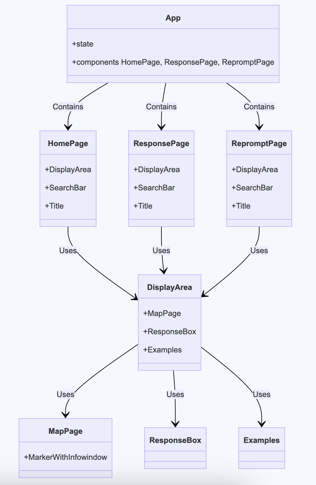

# Frontend Class Diagram

## Classes and Descriptions

### `App`
- **Attributes**: `state`
- **Components**: `HomePage`, `ResponsePage`, `RepromptPage`
- **Description**: The main application component which serves as the container for the homepage, response page, and reprompt page components.

### `HomePage`
- **Components**: `DisplayArea`, `SearchBar`, `Title`
- **Description**: Represents the home page of the application, integrating components for display, search, and title functionalities.

### `ResponsePage`
- **Components**: `DisplayArea`, `SearchBar`, `Title`
- **Description**: Manages the response page of the application, housing components to display search results and other relevant information.

### `RepromptPage`
- **Components**: `DisplayArea`, `SearchBar`, `Title`
- **Description**: Handles the reprompting of queries when the initial search does not yield results, providing suggestions for refined searches.

### `DisplayArea`
- **Components**: `MapPage`, `ResponseBox`, `Examples`
- **Description**: A versatile display component used across different pages to show maps, response data, and example queries.

### `MapPage`
- **Components**: `MarkerWithInfowindow`
- **Description**: Dedicated to displaying the map and managing markers with info-windows that provide additional information.

### `MarkerWithInfowindow`
- **Description**: Represents a map marker that can display an infowindow with more detailed information when interacted with.

